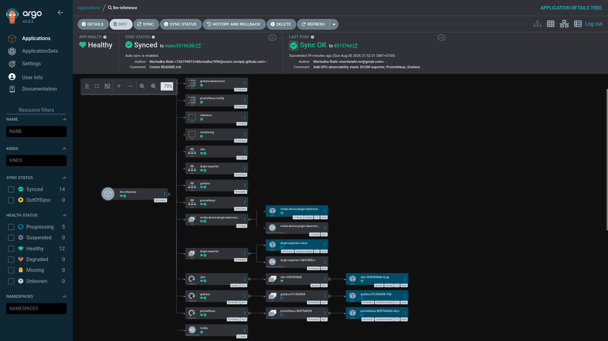
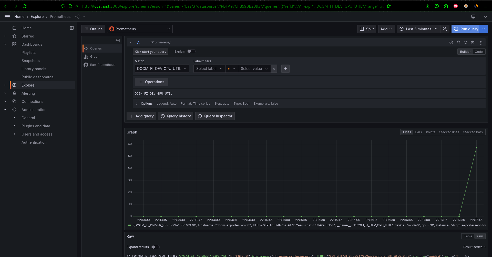
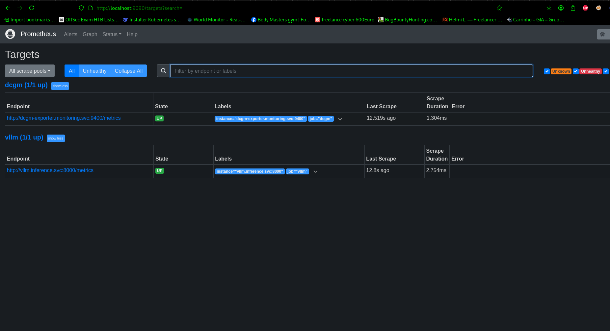

# LLM Inference Platform on Kubernetes

A self-hosted LLM serving platform running on a single GPU node, managed entirely through GitOps.

vLLM serves the model, ArgoCD reconciles the cluster from this repository, and DCGM feeds GPU telemetry into Prometheus and Grafana.

Built on a laptop with an RTX 3050 Ti and 4 GB of VRAM — the constraint is the interesting part.

---

## Why build this

Most LLM serving tutorials assume a datacentre GPU and a managed Kubernetes service. That hides the two things that actually matter in production: how the GPU gets exposed to the scheduler, and what happens when something fails at 2am.

Running it on constrained hardware forces both questions into the open.

---

## Architecture

```
┌──────────────────────────────────────────────────────────┐
│  Single node — Debian 13, RTX 3050 Ti (4 GB VRAM)        │
├──────────────────────────────────────────────────────────┤
│                                                           │
│  K3s + containerd + nvidia-container-runtime             │
│   │                                                       │
│   ├── RuntimeClass: nvidia                                │
│   ├── NVIDIA device plugin → nvidia.com/gpu: 1            │
│   │                                                       │
│   ├── namespace: inference                                │
│   │    └── vLLM (Qwen2.5-0.5B-Instruct)                   │
│   │         OpenAI-compatible API on :8000                │
│   │                                                       │
│   ├── namespace: monitoring                               │
│   │    ├── DCGM exporter  → GPU metrics on :9400          │
│   │    ├── Prometheus     → scrapes DCGM + vLLM           │
│   │    └── Grafana        → dashboards                    │
│   │                                                       │
│   └── namespace: argocd                                   │
│        └── ArgoCD → reconciles k8s/ from Git              │
│                                                           │
└──────────────────────────────────────────────────────────┘
                          ▲
                          │  git push
                          │
                    This repository
```

Git is the source of truth. A change pushed here reaches the cluster without anyone running `kubectl apply`.

---

## Screenshots

ArgoCD reconciling the full stack from Git:



GPU utilisation under load — 100 sequential requests:



Prometheus scraping DCGM and vLLM:




## Components

| Layer | What runs there |
|---|---|
| **Orchestration** | K3s single-node, containerd with the NVIDIA runtime |
| **GPU exposure** | NVIDIA device plugin advertising `nvidia.com/gpu` to the scheduler |
| **Serving** | vLLM with an OpenAI-compatible API |
| **GitOps** | ArgoCD with automated sync, prune and self-heal |
| **Observability** | DCGM exporter, Prometheus, Grafana |

---

## Serving on 4 GB of VRAM

The GPU has 4096 MiB total, and Xorg holds some of it. That leaves roughly 3.8 GB for the model, the KV cache and the CUDA context.

Three settings make it fit:

```yaml
args:
  - "--model"
  - "Qwen/Qwen2.5-0.5B-Instruct"
  - "--gpu-memory-utilization"
  - "0.70"          # leave headroom for the CUDA context
  - "--max-model-len"
  - "1024"          # smaller KV cache
  - "--dtype"
  - "half"          # FP16 instead of BF16
  - "--enforce-eager"  # skip CUDA graph compilation
```

`--enforce-eager` matters most. CUDA graph capture allocates a significant memory buffer at startup — disabling it costs some latency but is the difference between a running pod and a crash loop on this hardware.

---

## The bug that cost the most time

The pod entered a crash loop with an error that had nothing to do with GPUs:

```
ValueError: invalid literal for int() with base 10: 'tcp://10.43.102.211:8000'
```

Kubernetes injects environment variables for every Service in the namespace, following the pattern `{SERVICE_NAME}_PORT`. The Service here is named `vllm`, so the pod received:

```
VLLM_PORT=tcp://10.43.102.211:8000
```

vLLM reads its own `VLLM_PORT` variable and expects an integer. Collision.

Two fixes, both applied:

```yaml
spec:
  enableServiceLinks: false   # stop the injection entirely
  containers:
    - env:
        - name: VLLM_PORT
          value: "8000"       # and set it explicitly
```

This is a documented Kubernetes behaviour that almost never bites — until a container expects a variable with the same name as one of your Services.

---

## Repository layout

```
.
├── k8s/
│   ├── nvidia-runtimeclass.yaml     # RuntimeClass pointing at the nvidia handler
│   ├── nvidia-device-plugin.yaml    # DaemonSet exposing nvidia.com/gpu
│   ├── vllm.yaml                    # inference namespace, Deployment, Service
│   ├── monitoring-namespace.yaml
│   ├── dcgm-exporter.yaml           # GPU metrics DaemonSet
│   ├── prometheus.yaml              # config + Deployment + Service
│   └── grafana.yaml                 # datasource provisioning + Deployment
├── argocd/
│   └── application.yaml             # the Application that watches k8s/
└── README.md
```

---

## Setup

### Prerequisites

- Debian or Ubuntu with an NVIDIA GPU
- NVIDIA driver installed (`nvidia-smi` works)
- `nvidia-container-toolkit`

```bash
curl -fsSL https://nvidia.github.io/libnvidia-container/gpgkey | \
  sudo gpg --dearmor -o /usr/share/keyrings/nvidia-container-toolkit-keyring.gpg

curl -s -L https://nvidia.github.io/libnvidia-container/stable/deb/nvidia-container-toolkit.list | \
  sed 's#deb https://#deb [signed-by=/usr/share/keyrings/nvidia-container-toolkit-keyring.gpg] https://#g' | \
  sudo tee /etc/apt/sources.list.d/nvidia-container-toolkit.list

sudo apt update && sudo apt install -y nvidia-container-toolkit
```

### K3s

```bash
curl -sfL https://get.k3s.io | sh -s - --write-kubeconfig-mode 644

mkdir -p ~/.kube
sudo cp /etc/rancher/k3s/k3s.yaml ~/.kube/config
sudo chown $USER:$USER ~/.kube/config
export KUBECONFIG=~/.kube/config
```

K3s detects the NVIDIA runtime automatically when the toolkit is installed. Verify:

```bash
sudo grep -A3 nvidia /var/lib/rancher/k3s/agent/etc/containerd/config.toml
```

### GPU exposure

```bash
kubectl apply -f k8s/nvidia-runtimeclass.yaml
kubectl apply -f k8s/nvidia-device-plugin.yaml

# confirm the scheduler sees it
kubectl describe node | grep nvidia.com/gpu
```

### ArgoCD

```bash
kubectl create namespace argocd
kubectl apply -n argocd -f https://raw.githubusercontent.com/argoproj/argo-cd/stable/manifests/install.yaml

kubectl apply -f argocd/application.yaml
```

From here ArgoCD deploys everything under `k8s/` and keeps it in sync.

Access the UI:

```bash
kubectl port-forward -n argocd svc/argocd-server 8080:443
kubectl -n argocd get secret argocd-initial-admin-secret \
  -o jsonpath="{.data.password}" | base64 -d
```

---

## Using it

```bash
kubectl port-forward -n inference svc/vllm 8000:8000
```

```bash
curl http://localhost:8000/v1/chat/completions \
  -H "Content-Type: application/json" \
  -d '{
    "model": "Qwen/Qwen2.5-0.5B-Instruct",
    "messages": [{"role": "user", "content": "What does a Kubernetes Ingress do?"}],
    "max_tokens": 150
  }'
```

The API is OpenAI-compatible, so any OpenAI client library works by pointing `base_url` at it.

---

## Observability

```bash
kubectl port-forward -n monitoring svc/grafana 3000:3000
```

Useful queries:

| Query | Shows |
|---|---|
| `DCGM_FI_DEV_GPU_UTIL` | GPU utilisation % |
| `DCGM_FI_DEV_FB_USED` | VRAM in use (MiB) |
| `DCGM_FI_DEV_GPU_TEMP` | Temperature |
| `DCGM_FI_DEV_POWER_USAGE` | Power draw (W) |
| `vllm:num_requests_running` | In-flight requests |
| `vllm:time_to_first_token_seconds` | TTFT latency |
| `vllm:generation_tokens_total` | Tokens generated |

Under load — 100 sequential requests at 200 max tokens — GPU utilisation peaks around 57% on this hardware.

---

## GitOps in practice

`selfHeal: true` means the cluster corrects drift on its own:

```bash
kubectl delete deployment vllm -n inference
# ArgoCD recreates it from Git within seconds
```

Adding a component means committing a manifest, not running a command:

```bash
git add k8s/new-component.yaml
git commit -m "Add component"
git push
# ArgoCD picks it up on the next poll
```

---

## Things worth knowing

**Disk pressure evicts pods silently.** The kubelet evicts when free space drops below its threshold. Pods showed `DisruptionTarget: True` and cycled between Pending and Error with no obvious cause. Container images for vLLM and CUDA are several GB each — and pulling the same image through both Docker and containerd doubles the cost for nothing.

**Startup probes matter for slow-loading workloads.** Model loading takes minutes. A readiness probe with a short deadline kills the pod before it finishes. A permissive `startupProbe` gives it room, and readiness takes over afterwards.

**Port-forwards die quietly.** After a pod restart the tunnel keeps the local port bound but stops relaying. Requests hang with no error. Kill the process and restart it.

---

## Stack

Kubernetes (K3s) · NVIDIA device plugin · DCGM · vLLM · ArgoCD · Prometheus · Grafana · containerd

---

## Author

**Mortadha Riahi** — Infrastructure & Platform Engineer

RHCE · RHCSA · Red Hat Ansible (×2) · Red Hat Container Specialist · AWS Solutions Architect · CCNA

[LinkedIn](https://www.linkedin.com/in/mortadha-riahi/) · [AIOps anomaly detection](https://github.com/Mortadha1996/aiops-anomaly-detection)
